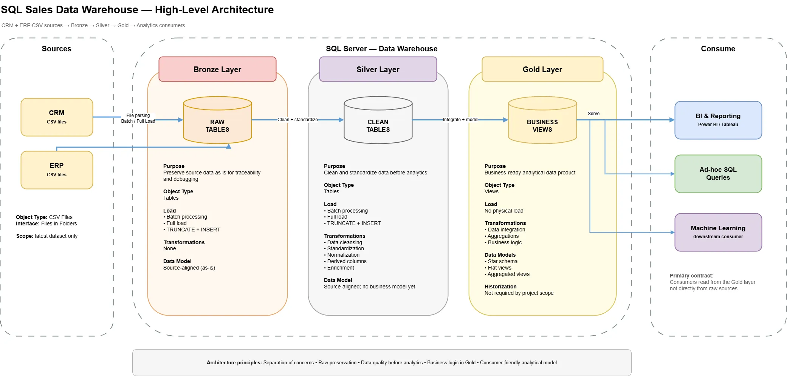
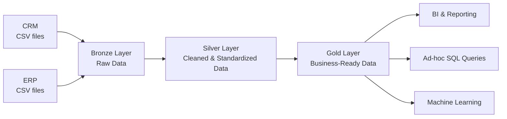

# SQL Data Warehouse Project

This project builds a **modern SQL Server data warehouse** that consolidates sales data from two operational source systems — **CRM** and **ERP** — and prepares it for analytical reporting and downstream consumption.

It follows the project scenario and learning sequence from **Data with Baraa's SQL Data Warehouse Project**, while the implementation, architecture documentation, validation evidence, repository structure, and later extensions are maintained as an independent portfolio project.

---

## Data Architecture

The warehouse uses a Medallion-style architecture with **Bronze**, **Silver**, and **Gold** layers.





Editable source: [`docs/data_architecture.drawio`](docs/data_architecture.drawio)

### Bronze Layer

**Purpose:** preserve source data as-is for traceability and debugging.

- Object type: SQL tables
- Processing: batch
- Load strategy: full load
- Baseline load method: `TRUNCATE` + `INSERT`
- Transformations: none
- Data model: source-aligned / as-is

### Silver Layer

**Purpose:** create clean, standardized, analysis-ready source-aligned datasets.

- Object type: SQL tables
- Processing: batch
- Load strategy: full load
- Baseline load method: `TRUNCATE` + `INSERT`
- Transformations:
  - data cleansing
  - standardization
  - normalization
  - derived columns
  - enrichment
- Data model: remains source-aligned; business modeling is deferred to Gold

### Gold Layer

**Purpose:** expose business-ready analytical data.

- Object type: views
- Physical load: none in the baseline design
- Transformations:
  - data integration
  - aggregations where required
  - business rules and logic
- Data modeling:
  - star schema
  - dimensional views
  - flat or aggregated analytical views when justified
- Primary consumers:
  - BI and reporting
  - ad-hoc SQL analysis
  - downstream machine-learning workloads

---

## Project Requirements

### Objective

Develop a modern data warehouse using SQL Server to consolidate sales data, enabling analytical reporting and informed decision-making.

### Specifications

- **Data Sources:** import data from two source systems, ERP and CRM, provided as CSV files.
- **Data Quality:** cleanse and resolve data-quality issues before analytical use.
- **Integration:** combine both sources into a single, user-friendly analytical model.
- **Scope:** focus on the latest dataset; source-record historization is not required for the baseline project.
- **Documentation:** provide clear documentation for business stakeholders and analytics users.

Detailed requirements: [`docs/project_requirements.md`](docs/project_requirements.md)

---

## Architecture Decisions

The current design is intentionally constrained by the project requirements:

1. **SQL Server** is the target warehouse platform.
2. **Bronze / Silver / Gold** separate ingestion, cleansing, and business consumption responsibilities.
3. **Batch full loads** are used in the baseline because the project focuses on the latest dataset.
4. **Historization and CDC are out of scope** for the baseline implementation.
5. **Gold is the analytical consumer contract**; downstream users should not query raw Bronze data directly.

Decision log: [`docs/architecture_decisions.md`](docs/architecture_decisions.md)

---

## Project Plan

The implementation is managed as six epics:

1. Requirements Analysis
2. Design Data Architecture
3. Project Initialization
4. Build Bronze Layer
5. Build Silver Layer
6. Build Gold Layer

Each build epic follows the same engineering pattern:

```text
Analyze → Code → Validate → Document → Commit
```

Detailed task plan and current status: [`docs/project_plan.md`](docs/project_plan.md)

---

## Naming Standards

The project defines naming rules before implementation to reduce inconsistency across schemas, tables, columns, procedures, scripts, and documentation.

Core rules:

- English language
- `lower_snake_case`
- no SQL reserved words as object names
- Bronze/Silver tables use `<source_system>_<source_entity>`
- Gold dimensional objects use `dim_` / `fact_` prefixes
- surrogate keys use the `_key` suffix
- technical warehouse columns use the `dwh_` prefix
- layer load procedures follow `load_<layer>`

Full standard: [`docs/naming_conventions.md`](docs/naming_conventions.md)

---

## Current Status

| Epic | Status |
|---|---|
| Requirements Analysis | Complete |
| Design Data Architecture | Complete |
| Project Initialization — Detailed Project Tasks | Complete |
| Project Initialization — Naming Conventions | Complete |
| Project Initialization — Git Repo & Structure | Complete |
| Project Initialization — Create Database & Schemas | **Next** |
| Build Bronze Layer | Not started |
| Build Silver Layer | Not started |
| Build Gold Layer | Not started |

The SQL implementation is intentionally not pre-populated from the reference repository. Scripts will be added as each milestone is implemented and reviewed.

---

## Repository Structure

```text
01_data_warehouse/
├── datasets/
│   ├── source_crm/
│   └── source_erp/
├── docs/
│   ├── data_architecture.drawio
│   ├── data_architecture.webp
│   ├── project_requirements.md
│   ├── project_plan.md
│   ├── architecture_decisions.md
│   ├── naming_conventions.md
│   ├── data_flow/
│   └── data_model/
├── scripts/
│   ├── bronze/
│   ├── silver/
│   └── gold/
└── tests/
    ├── bronze/
    ├── silver/
    └── gold/
```

Future artifacts such as source-system analysis, data-flow diagrams, data-model diagrams, data catalog, DDL, ETL procedures, and quality checks will be added only when their corresponding project milestone is reached.

---

## Tools

- Microsoft SQL Server
- SQL Server Management Studio (SSMS)
- T-SQL
- CSV source files
- Git / GitHub
- diagrams.net / Draw.io
- Notion

---

## Portfolio Intent

The goal is to demonstrate more than SQL syntax. The repository is designed to show an engineering process that can be discussed in a technical interview:

- translating requirements into architecture decisions
- separating responsibilities across data layers
- preserving raw-source traceability
- implementing and validating ETL logic
- integrating multiple source systems
- building a consumer-friendly analytical model
- documenting design, lineage, data quality, and limitations
- using Git throughout the implementation lifecycle

---

## Attribution

The project scenario, learning sequence, and source datasets are based on **Data with Baraa's SQL Data Warehouse Project**. The implementation and documentation in this repository are maintained as an independent learning and portfolio build. See the repository-level [`ACKNOWLEDGEMENTS.md`](../ACKNOWLEDGEMENTS.md).

## License

MIT License — see [`../LICENSE`](../LICENSE).
