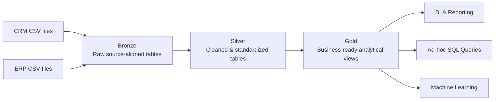
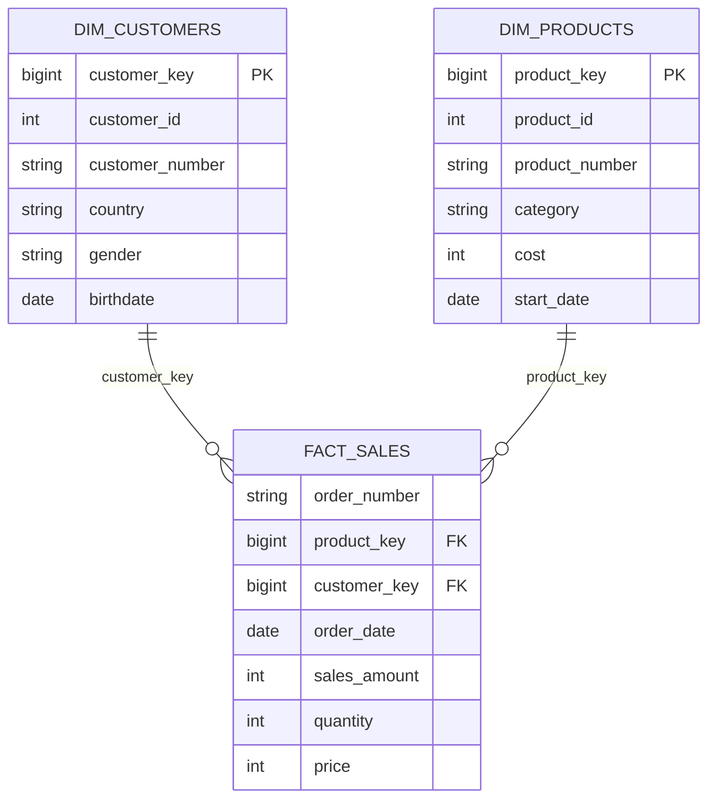

# SQL Data Warehouse Project

This project builds a **modern SQL Server data warehouse** that consolidates sales data from two operational source systems — **CRM** and **ERP** — and prepares it for analytical reporting and downstream consumption.

It follows the project scenario and implementation sequence from **Data with Baraa's SQL Data Warehouse Project**, while the code, validation evidence, documentation, engineering learnings, and selected refinements are maintained as an independent portfolio implementation.

---

## Data Architecture

The warehouse uses a Medallion-style architecture with **Bronze**, **Silver**, and **Gold** layers.


Editable source: [`docs/data_architecture.drawio`](docs/data_architecture.drawio)



### Bronze Layer

**Purpose:** preserve source data for traceability and downstream quality analysis.

- Object type: SQL tables
- Processing: batch
- Load strategy: full refresh
- Load method: `TRUNCATE TABLE` + `BULK INSERT`
- CSV header handling: `FIRSTROW = 2`
- Field delimiter: comma
- Transformations: none
- Data model: source-aligned / as-is
- Load procedure: `bronze.load_bronze`

### Silver Layer

**Purpose:** create clean, standardized, analysis-ready source-aligned datasets.

Implemented responsibilities include:

- data cleansing
- standardization
- normalization
- data-type correction
- derived columns
- enrichment
- technical warehouse metadata

Implementation artifacts:

- [`scripts/silver/ddl_silver.sql`](scripts/silver/ddl_silver.sql) — six rerunnable source-aligned Silver tables
- [`scripts/silver/proc_load_silver.sql`](scripts/silver/proc_load_silver.sql) — `silver.load_silver` full-refresh transformations
- [`tests/silver/quality_checks_silver.sql`](tests/silver/quality_checks_silver.sql) — diagnostic correctness and relationship checks

The implementation stays close to the course baseline. Small evidence-backed refinements reject implausible 1900–2050 sales dates, propagate load errors with `THROW`, and map the observed CRM pedal category code `CO_PE` to ERP's `CO_PD` category key.

### Gold Layer

**Purpose:** expose business-ready analytical data.

Implemented responsibilities:

- CRM/ERP data integration
- documented gender source precedence
- two dimensions and one fact
- current-product filtering
- consumer-friendly naming
- SQL Server views as the analytical contract

Gold objects:

- `gold.dim_customers` — 18,484 customers
- `gold.dim_products` — 295 current products
- `gold.fact_sales` — 60,398 source sales lines

Implementation and validation:

- [`scripts/gold/ddl_gold.sql`](scripts/gold/ddl_gold.sql)
- [`tests/gold/quality_checks_gold.sql`](tests/gold/quality_checks_gold.sql)
- [`docs/data_model/gold_star_schema.drawio`](docs/data_model/gold_star_schema.drawio)
- [`docs/data_catalog/gold_data_catalog.md`](docs/data_catalog/gold_data_catalog.md)

---

## Project Requirements

### Objective

Develop a modern data warehouse using SQL Server to consolidate sales data, enabling analytical reporting and informed decision-making.

### Specifications

- **Data Sources:** import data from ERP and CRM CSV files.
- **Data Quality:** cleanse and resolve data-quality issues before analytical use.
- **Integration:** combine both sources into a single, user-friendly analytical model.
- **Scope:** focus on the latest dataset; historization is not required for the baseline project.
- **Documentation:** provide clear documentation for business stakeholders and analytics users.

Detailed requirements: [`docs/project_requirements.md`](docs/project_requirements.md)

---

## Source Systems

The Bronze layer ingests six CSV files.

| Source | File | Bronze target |
|---|---|---|
| CRM | `cust_info.csv` | `bronze.crm_cust_info` |
| CRM | `prd_info.csv` | `bronze.crm_prd_info` |
| CRM | `sales_details.csv` | `bronze.crm_sales_details` |
| ERP | `CUST_AZ12.csv` | `bronze.erp_cust_az12` |
| ERP | `LOC_A101.csv` | `bronze.erp_loc_a101` |
| ERP | `PX_CAT_G1V2.csv` | `bronze.erp_px_cat_g1v2` |

Detailed inventory and row-count notes: [`docs/source_systems.md`](docs/source_systems.md)

Dataset placement notes: [`datasets/README.md`](datasets/README.md)

---

## Final Gold Star Schema



Grain:

- `dim_customers`: one row per CRM customer;
- `dim_products`: one row per current product (`prd_end_dt IS NULL`);
- `fact_sales`: one row per unique order/product source sales line.

Gold uses logical relationships in views rather than declared database PK/FK constraints. Runtime checks validate business-key uniqueness, join cardinality, fact preservation and referential integrity.

Detailed model: [`docs/data_model/gold_star_schema.drawio`](docs/data_model/gold_star_schema.drawio)

Column-level lineage: [`docs/data_catalog/gold_data_catalog.md`](docs/data_catalog/gold_data_catalog.md)

---

## Bronze Implementation

### 1. Create database and schemas

```text
scripts/init_database.sql
```

Creates:

```text
DataWarehouse
├── bronze
├── silver
└── gold
```

### 2. Create Bronze tables

```text
scripts/bronze/ddl_bronze.sql
```

Creates the six source-aligned Bronze tables. Bronze intentionally avoids primary keys, `NOT NULL` constraints, and business validation that could reject source-quality issues before analysis.

### 3. Create the Bronze loader

```text
scripts/bronze/proc_load_bronze.sql
```

The procedure implements the reference-project full-load pattern:

```text
TRUNCATE TABLE
      ↓
BULK INSERT
```

for every CRM and ERP source file.

Run the loader with:

```sql
EXEC bronze.load_bronze;
```

The procedure also reports the current pipeline stage, measures per-table and total batch duration, and reports errors with `TRY...CATCH` and `THROW`.

### Local path configuration

The current `BULK INSERT` file paths reflect the local development machine. SQL Server must be able to access those paths through the SQL Server service account. When cloning this repository on another machine, adapt the file paths or deploy the CSV files to an equivalent accessible location.

---

## Bronze Validation

Validation is stored separately from implementation code.

### Schema validation

[`tests/bronze/01_validate_bronze_schema.sql`](tests/bronze/01_validate_bronze_schema.sql)

Checks/inspects:

- expected Bronze tables
- column order
- SQL data types
- text lengths
- source-column nullability

### Load validation

[`tests/bronze/02_validate_bronze_load.sql`](tests/bronze/02_validate_bronze_load.sql)

Checks:

- loaded row counts against the course baseline
- logical source-row counts for reconciliation context
- sample field mapping
- repeatability of the `TRUNCATE + BULK INSERT` full refresh

Two supplied CSV files exhibit an EOF/line-ending edge case under the simple course `BULK INSERT` pattern. The validation documents this explicitly rather than hiding the difference between logical CSV records and the observed course load baseline.

---

## Architecture Decisions

Current accepted decisions include:

1. Microsoft SQL Server and T-SQL.
2. Bronze / Silver / Gold separation of concerns.
3. Source fidelity and permissive ingestion in Bronze.
4. Batch full loads for the baseline.
5. No warehouse historization/CDC in baseline scope.
6. `BULK INSERT` for Bronze CSV ingestion.
7. Gold as the implemented analytical consumer contract.
8. Reproducible schema/load validation stored in Git.

Decision log: [`docs/architecture_decisions.md`](docs/architecture_decisions.md)

---

## Project Plan and Current Status

The implementation is managed as six epics:

1. Requirements Analysis
2. Design Data Architecture
3. Project Initialization
4. Build Bronze Layer
5. Build Silver Layer
6. Build Gold Layer

Each build epic follows:

```text
Analyze → Code → Validate → Document → Commit
```

| Epic | Status |
|---|---|
| Requirements Analysis | Complete |
| Design Data Architecture | Complete |
| Project Initialization | Complete |
| Bronze — Source Analysis | Complete |
| Bronze — DDL & Ingestion | Complete |
| Bronze — Schema/Load Validation | Complete |
| Bronze — Data Flow Diagram | Complete (published artifact) |
| Silver — Analysis, DDL, Load & Validation | Complete |
| Silver — Data Integration Diagram | Complete (published artifact) |
| Silver — Extended Data Flow Diagram | Complete |
| Gold — Views & Validation | Complete |
| Gold — Model, Catalog & Lineage | Complete |

Detailed plan: [`docs/project_plan.md`](docs/project_plan.md)

---

## Engineering Learning Journal

In addition to implementation artifacts, the repository records the **reasoning and engineering lessons** from each completed phase. These notes focus on what a data engineer must understand, verify, communicate, and monitor rather than on tool syntax.

Start here: [`learnings/README.md`](learnings/README.md)

Current phase notes:

1. [Requirements Analysis](learnings/01_requirements_analysis.md)
2. [Data Architecture](learnings/02_data_architecture.md)
3. [Project Initialization](learnings/03_project_initialization.md)
4. [Bronze Layer](learnings/04_bronze_layer.md)
5. [Silver Layer](learnings/05_silver_layer.md)
6. [Gold Layer](learnings/06_gold_layer.md)

The learning path now covers requirements, architecture, initialization, ingestion, cleansing and dimensional integration. The Gold note focuses on business objects, grain, source precedence, cardinality, fact preservation and consumer contracts.

---

## Naming Standards

Core rules:

- English language
- `lower_snake_case`
- no SQL reserved words as object names
- Bronze/Silver tables use `<source_system>_<source_entity>`
- Gold dimensional objects use `dim_` / `fact_`
- surrogate keys use `_key`
- technical warehouse columns use `dwh_`
- load procedures use `load_<layer>`

Full standard: [`docs/naming_conventions.md`](docs/naming_conventions.md)

---

## Repository Structure

```text
01_data_warehouse/
├── datasets/
│   ├── README.md
│   ├── source_crm/
│   └── source_erp/
├── docs/
│   ├── data_architecture.drawio
│   ├── data_architecture.webp
│   ├── project_requirements.md
│   ├── project_plan.md
│   ├── architecture_decisions.md
│   ├── naming_conventions.md
│   ├── source_systems.md
│   ├── data_flow/
│   │   ├── bronze_data_flow.webp
│   │   ├── bronze_silver_data_flow.webp
│   │   └── bronze_silver_gold_data_flow.drawio
│   ├── data_integration/
│   │   ├── README.md
│   │   ├── Data Integration Model.webp
│   │   └── Business Objects Integration Model.webp
│   ├── data_model/
│   │   └── gold_star_schema.drawio
│   └── data_catalog/
│       └── gold_data_catalog.md
├── learnings/
│   ├── README.md
│   ├── 01_requirements_analysis.md
│   ├── 02_data_architecture.md
│   ├── 03_project_initialization.md
│   ├── 04_bronze_layer.md
│   ├── 05_silver_layer.md
│   └── 06_gold_layer.md
├── scripts/
│   ├── init_database.sql
│   ├── bronze/
│   │   ├── ddl_bronze.sql
│   │   └── proc_load_bronze.sql
│   ├── silver/
│   │   ├── ddl_silver.sql
│   │   └── proc_load_silver.sql
│   └── gold/
│       └── ddl_gold.sql
└── tests/
    ├── bronze/
    │   ├── 01_validate_bronze_schema.sql
    │   └── 02_validate_bronze_load.sql
    ├── silver/
    │   └── quality_checks_silver.sql
    └── gold/
        └── quality_checks_gold.sql
```

---

## Execution Order

`scripts/init_database.sql` is destructive: it drops and recreates `DataWarehouse`. Use it only for an intentional clean setup.

```sql
-- 1. Run scripts/init_database.sql only for a clean rebuild.
-- 2. Run scripts/bronze/ddl_bronze.sql.
-- 3. Run scripts/bronze/proc_load_bronze.sql, then:
EXEC bronze.load_bronze;

-- 4. Run scripts/silver/ddl_silver.sql.
-- 5. Run scripts/silver/proc_load_silver.sql, then:
EXEC silver.load_silver;

-- 6. Run scripts/gold/ddl_gold.sql.
-- 7. Run the Bronze, Silver and Gold validation scripts.
```

Gold is view-based and therefore has no loading stored procedure.

## Known Scope Limitations

- latest-snapshot full loads rather than incremental loading or history;
- local SQL Server `BULK INSERT` paths require deployment-specific adjustment;
- two CSV EOF/line-ending differences are documented in Bronze reconciliation;
- `ROW_NUMBER()` surrogate keys in views are not stable when dimension populations change;
- Gold is calculated at query time rather than materialized;
- diagnostic SQL quality checks rather than an external automated framework;
- no orchestration, persistent monitoring, date dimension, CDC or SCD infrastructure.

These are accepted learning-project constraints, not claims of production readiness.

---

## Tools

- Microsoft SQL Server
- SQL Server Management Studio (SSMS)
- T-SQL
- CSV source files
- Git / GitHub
- diagrams.net / Draw.io
- Notion

---

## Portfolio Intent

The repository is intended to demonstrate an engineering process rather than only SQL syntax:

- requirements-to-architecture reasoning
- separation of warehouse responsibilities
- source-system analysis
- source-aligned DDL design
- reproducible file ingestion
- data-quality and reconciliation awareness
- operational observability and error diagnosis
- validation before downstream use
- documentation and version-controlled evidence
- explicit reflection on the engineering decisions behind each phase

---

## Attribution

The project scenario, learning sequence, and source datasets are based on **Data with Baraa's SQL Data Warehouse Project**. The implementation and documentation in this repository are maintained as an independent learning and portfolio build. See [`../ACKNOWLEDGEMENTS.md`](../ACKNOWLEDGEMENTS.md).

## License

MIT License — see [`../LICENSE`](../LICENSE).
