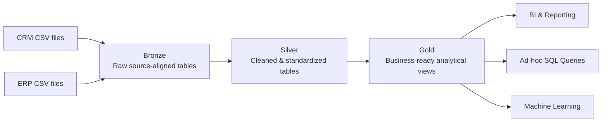
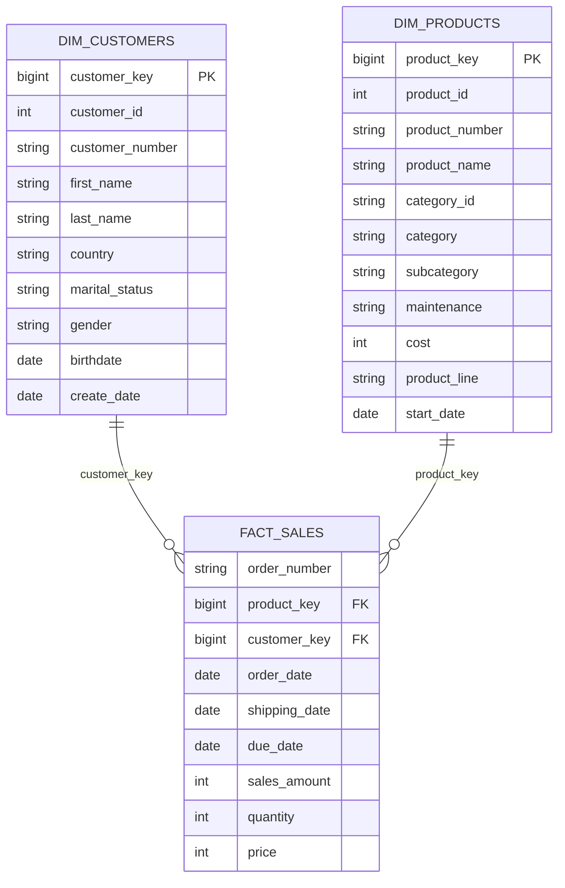

# SQL Data Warehouse Project

This project builds a **SQL Server sales data warehouse** that consolidates data from two operational source systems — **CRM** and **ERP** — and prepares it for analytical reporting through a Bronze/Silver/Gold architecture.

It follows the scenario and implementation sequence from **Data with Baraa's SQL Data Warehouse Project**. The repository is maintained as an independent portfolio implementation: the reference solution defines the baseline, while the code, validation evidence, documentation, learning journal, and a small number of data-backed refinements are version-controlled here.

## Project Status

**Complete.** All six project epics are implemented and documented:

```text
Requirements Analysis
        ↓
Data Architecture
        ↓
Project Initialization
        ↓
Bronze
        ↓
Silver
        ↓
Gold
```

The build follows the course engineering cycle:

```text
Analyze → Code → Validate → Document → Commit
```

Detailed status: [`docs/project_plan.md`](docs/project_plan.md)

---

## Data Architecture


Editable source: [`docs/data_architecture.drawio`](docs/data_architecture.drawio)



### Bronze — preserve the source

- SQL tables
- batch/full refresh
- `TRUNCATE TABLE` + `BULK INSERT`
- `FIRSTROW = 2`, comma field delimiter
- no cleansing or business transformations
- source-aligned naming
- load procedure: `bronze.load_bronze`

### Silver — make source data trustworthy

- six source-aligned SQL tables
- `TRUNCATE TABLE` + `INSERT`
- cleansing, standardization and normalization
- data-type correction and derived integration keys
- technical metadata via `dwh_create_date`
- load procedure: `silver.load_silver`

The Silver implementation stays close to the course baseline. Targeted refinements are limited to issues evidenced by the supplied dataset or to minimal failure-signaling improvements: implausible sales dates are rejected, the observed CRM `CO_PE` pedal category is aligned to ERP `CO_PD`, and stored-procedure errors are re-thrown to callers.

### Gold — integrate business objects

Gold is exposed as SQL Server **views**, not a separate physical load.

- `gold.dim_customers` — **18,484** customers
- `gold.dim_products` — **295** current products
- `gold.fact_sales` — **60,398** source sales lines

Gold integrates the business objects CUSTOMER, PRODUCT and SALES, applies documented source precedence, resolves surrogate keys, and exposes consumer-friendly column names.

---

## Project Requirements

The baseline requirement is to consolidate CRM and ERP sales data in SQL Server, resolve data-quality issues before analytical use, integrate the sources into a user-friendly model, focus on the latest dataset rather than historization, and provide clear documentation.

Detailed requirements: [`docs/project_requirements.md`](docs/project_requirements.md)

---

## Source Systems

| Source | File | Bronze target |
|---|---|---|
| CRM | `cust_info.csv` | `bronze.crm_cust_info` |
| CRM | `prd_info.csv` | `bronze.crm_prd_info` |
| CRM | `sales_details.csv` | `bronze.crm_sales_details` |
| ERP | `CUST_AZ12.csv` | `bronze.erp_cust_az12` |
| ERP | `LOC_A101.csv` | `bronze.erp_loc_a101` |
| ERP | `PX_CAT_G1V2.csv` | `bronze.erp_px_cat_g1v2` |

Source inventory and row-count notes: [`docs/source_systems.md`](docs/source_systems.md)

Local dataset setup: [`datasets/README.md`](datasets/README.md)

The course CSVs are intentionally not committed to this repository.

---

## Final Gold Star Schema



Validated grain:

- `dim_customers`: one row per CRM customer;
- `dim_products`: one row per current product (`prd_end_dt IS NULL`);
- `fact_sales`: one row per unique source order-number/product-number sales line.

The PK/FK markers represent logical analytical relationships between views; no physical database PK/FK constraints are declared in Gold.

- Editable model: [`docs/data_model/gold_star_schema.drawio`](docs/data_model/gold_star_schema.drawio)
- Rendered model: [`docs/data_model/gold_star_schema.webp`](docs/data_model/gold_star_schema.webp)
- Column-level catalog: [`docs/data_catalog/gold_data_catalog.md`](docs/data_catalog/gold_data_catalog.md)

---

## Validation Strategy

Validation is kept separate from implementation code.

### Bronze

- [`tests/bronze/01_validate_bronze_schema.sql`](tests/bronze/01_validate_bronze_schema.sql)
- [`tests/bronze/02_validate_bronze_load.sql`](tests/bronze/02_validate_bronze_load.sql)

These validate object structure, source-to-target mapping, loaded row counts, and the documented CSV EOF behavior of the simple course `BULK INSERT` pattern.

### Silver

- [`tests/silver/quality_checks_silver.sql`](tests/silver/quality_checks_silver.sql)

Checks cover duplicates/null identifiers, whitespace, standardized domains, date validity/order, sales-measure consistency, derived keys, and cross-source relationship readiness.

### Gold

- [`tests/gold/quality_checks_gold.sql`](tests/gold/quality_checks_gold.sql)

Checks cover dimension grain, surrogate-key uniqueness, join fan-out, fact row preservation, fact-to-dimension connectivity, and preservation of Silver dates/measures.

Runtime evidence recorded during the completed build shows the Gold views at 18,484 customer rows, 295 current product rows and 60,398 fact rows with the expected no-results checks clean.

---

## Documentation and Lineage

The project keeps distinct documentation for different questions:

- **Architecture:** what components/layers exist?
- **Integration:** how are source entities related and grouped into business objects?
- **Data flow / lineage:** where does each dataset come from and where does it go?
- **Data model:** how do consumers join Gold objects?
- **Data catalog:** what does each Gold object and column mean?

Start with the [`docs/README.md`](docs/README.md) documentation index.

Key artifacts:

- [`docs/data_architecture.drawio`](docs/data_architecture.drawio)
- [`docs/data_flow/bronze_silver_gold_data_flow.drawio`](docs/data_flow/bronze_silver_gold_data_flow.drawio)
- [`docs/data_integration/data_integration_model.webp`](docs/data_integration/data_integration_model.webp)
- [`docs/data_integration/business_object_integration_model.webp`](docs/data_integration/business_object_integration_model.webp)
- [`docs/data_model/gold_star_schema.drawio`](docs/data_model/gold_star_schema.drawio)
- [`docs/data_catalog/gold_data_catalog.md`](docs/data_catalog/gold_data_catalog.md)

---

## Engineering Learning Journal

The learning journal records engineering judgment rather than reproducing SQL syntax:

1. [Requirements Analysis](learnings/01_requirements_analysis.md)
2. [Data Architecture](learnings/02_data_architecture.md)
3. [Project Initialization](learnings/03_project_initialization.md)
4. [Bronze Layer](learnings/04_bronze_layer.md)
5. [Silver Layer](learnings/05_silver_layer.md)
6. [Gold Layer](learnings/06_gold_layer.md)

Start here: [`learnings/README.md`](learnings/README.md)

---

## Naming Standards

The implementation follows the conventions established at initialization:

- English
- `lower_snake_case`
- Bronze/Silver tables: `<source_system>_<source_entity>`
- Gold objects: `dim_<entity>` / `fact_<business_process>`
- surrogate keys: `<entity>_key`
- warehouse metadata: `dwh_<purpose>`
- layer loaders: `load_<layer>`

Source-supplied filenames retain their upstream casing where required for traceability and local file access.

Full standard: [`docs/naming_conventions.md`](docs/naming_conventions.md)

---

## Repository Structure

```text
01_data_warehouse/
├── datasets/
│   ├── README.md
│   ├── source_crm/
│   └── source_erp/
├── docs/
│   ├── README.md
│   ├── data_architecture.drawio
│   ├── data_architecture.webp
│   ├── project_requirements.md
│   ├── project_plan.md
│   ├── architecture_decisions.md
│   ├── naming_conventions.md
│   ├── source_systems.md
│   ├── data_flow/
│   │   ├── bronze_data_flow.webp
│   │   ├── bronze_silver_data_flow.webp
│   │   ├── bronze_silver_gold_data_flow.drawio
│   │   └── bronze_silver_gold_data_flow.webp
│   ├── data_integration/
│   │   ├── README.md
│   │   ├── data_integration_model.webp
│   │   └── business_object_integration_model.webp
│   ├── data_model/
│   │   ├── gold_star_schema.drawio
│   │   └── gold_star_schema.webp
│   └── data_catalog/
│       └── gold_data_catalog.md
├── learnings/
│   ├── README.md
│   ├── 01_requirements_analysis.md
│   ├── 02_data_architecture.md
│   ├── 03_project_initialization.md
│   ├── 04_bronze_layer.md
│   ├── 05_silver_layer.md
│   └── 06_gold_layer.md
├── scripts/
│   ├── init_database.sql
│   ├── bronze/
│   │   ├── ddl_bronze.sql
│   │   └── proc_load_bronze.sql
│   ├── silver/
│   │   ├── ddl_silver.sql
│   │   └── proc_load_silver.sql
│   └── gold/
│       └── ddl_gold.sql
└── tests/
    ├── bronze/
    │   ├── 01_validate_bronze_schema.sql
    │   └── 02_validate_bronze_load.sql
    ├── silver/
    │   └── quality_checks_silver.sql
    └── gold/
        └── quality_checks_gold.sql
```

---

## Execution Order

`scripts/init_database.sql` is destructive: it drops and recreates `DataWarehouse`. Use it only for an intentional clean rebuild.

```sql
-- 1. Run scripts/init_database.sql only for a clean rebuild.
-- 2. Run scripts/bronze/ddl_bronze.sql.
-- 3. Run scripts/bronze/proc_load_bronze.sql, then:
EXEC bronze.load_bronze;

-- 4. Run scripts/silver/ddl_silver.sql.
-- 5. Run scripts/silver/proc_load_silver.sql, then:
EXEC silver.load_silver;

-- 6. Run scripts/gold/ddl_gold.sql.
-- 7. Run the Bronze, Silver and Gold validation scripts.
```

Gold is view-based and therefore has no loading stored procedure.

---

## Known Scope Limitations

- latest-snapshot full loads rather than incremental loading or historization;
- local SQL Server `BULK INSERT` paths require deployment-specific adjustment;
- two CSV EOF/line-ending differences are documented in Bronze reconciliation;
- `ROW_NUMBER()` surrogate keys in Gold views are snapshot-scoped rather than durable historical keys;
- Gold is calculated at query time rather than materialized;
- diagnostic SQL quality checks rather than an external automated test framework;
- no orchestration, persistent monitoring, date dimension, CDC or SCD infrastructure.

These are accepted learning-project constraints, not claims of production readiness.

---

## Attribution

The project scenario, learning sequence, reference SQL, slides, and source datasets are based on **Data with Baraa's SQL Data Warehouse Project**. The implementation and documentation in this repository are maintained as an independent learning and portfolio build. See [`../ACKNOWLEDGEMENTS.md`](../ACKNOWLEDGEMENTS.md).

## License

MIT License — see [`../LICENSE`](../LICENSE).
