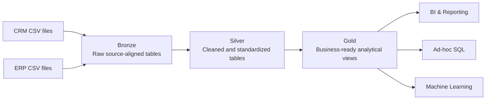

# SQL Data Engineering Portfolio

This repository contains a connected SQL Server portfolio track covering **data warehousing**, **exploratory data analysis**, and **advanced SQL analytics**.

The projects follow the sequence taught by **Data with Baraa**, but are maintained as an independent portfolio implementation with explicit requirements, architecture decisions, validation, documentation, and engineering learnings. The intent is to preserve the course scope while adding only targeted improvements that are supported by the supplied data or improve clarity and testability.

## Portfolio Track

| Project | Focus | Status |
|---|---|---|
| [01 — SQL Data Warehouse](01_data_warehouse/) | CRM + ERP ingestion, Bronze/Silver/Gold architecture, data quality, integration, dimensional modeling and lineage | **Complete** |
| [02 — Exploratory Data Analysis](02_exploratory_data_analysis/) | Data profiling, dimensions, date ranges, measures, magnitude and ranking analysis | Planned |
| [03 — Advanced Data Analytics](03_advanced_data_analytics/) | Trends, cumulative analysis, performance analysis, segmentation, part-to-whole and reporting views | Planned |

## Completed Data Warehouse

The first project implements the complete course warehouse flow:



The completed warehouse includes:

- requirements and architecture decisions;
- SQL Server Bronze/Silver/Gold schemas;
- six source-aligned Bronze tables and `bronze.load_bronze`;
- six cleansed Silver tables and `silver.load_silver`;
- Bronze, Silver and Gold quality checks;
- Gold views `dim_customers`, `dim_products`, and `fact_sales`;
- source-to-Gold lineage, integration documentation and a star-schema model;
- a column-level Gold data catalog;
- a phase-based engineering learning journal.

Runtime evidence recorded in the project documentation shows the validated Gold snapshot at **18,484 customers**, **295 current products**, and **60,398 sales lines**.

Start with the [Data Warehouse project README](01_data_warehouse/README.md) or the [documentation index](01_data_warehouse/docs/README.md).

## Engineering Principles

- **Separation of concerns:** Bronze preserves, Silver cleans and standardizes, Gold integrates and serves.
- **Data quality before analytics:** each layer is validated before downstream use.
- **Traceability:** source mappings, decisions, lineage and tests are version-controlled.
- **Explicit analytical grain:** dimensions and facts are validated for cardinality and row preservation.
- **Scope discipline:** the project stays within the SQL Server learning scenario rather than adding unrelated tooling.
- **Engineering reflection:** each warehouse phase records the reasoning and failure modes behind the implementation.

## Repository Structure

```text
sql-data-engineering-portfolio/
├── 01_data_warehouse/
│   ├── datasets/
│   ├── docs/
│   │   ├── README.md
│   │   ├── data_flow/
│   │   ├── data_integration/
│   │   ├── data_model/
│   │   └── data_catalog/
│   ├── learnings/
│   │   ├── README.md
│   │   ├── 01_requirements_analysis.md
│   │   ├── 02_data_architecture.md
│   │   ├── 03_project_initialization.md
│   │   ├── 04_bronze_layer.md
│   │   ├── 05_silver_layer.md
│   │   └── 06_gold_layer.md
│   ├── scripts/
│   │   ├── init_database.sql
│   │   ├── bronze/
│   │   ├── silver/
│   │   └── gold/
│   └── tests/
│       ├── bronze/
│       ├── silver/
│       └── gold/
├── 02_exploratory_data_analysis/
├── 03_advanced_data_analytics/
├── ACKNOWLEDGEMENTS.md
├── LICENSE
├── .editorconfig
└── .gitignore
```

## Technology

- Microsoft SQL Server
- T-SQL
- SQL Server Management Studio (SSMS)
- CSV source files
- Git / GitHub
- diagrams.net / Draw.io

## Data Warehouse Documentation

Key entry points:

- [Project README](01_data_warehouse/README.md)
- [Documentation index](01_data_warehouse/docs/README.md)
- [Project requirements](01_data_warehouse/docs/project_requirements.md)
- [Architecture decisions](01_data_warehouse/docs/architecture_decisions.md)
- [Naming conventions](01_data_warehouse/docs/naming_conventions.md)
- [End-to-end lineage](01_data_warehouse/docs/data_flow/bronze_silver_gold_data_flow.drawio)
- [Gold star schema](01_data_warehouse/docs/data_model/gold_star_schema.drawio)
- [Gold data catalog](01_data_warehouse/docs/data_catalog/gold_data_catalog.md)
- [Engineering learning journal](01_data_warehouse/learnings/README.md)

## Attribution

The learning baseline, project scenario, and source datasets originate from **Data with Baraa's SQL course and project materials**. This repository documents an independent implementation process, validation work, documentation, and targeted refinements. See [`ACKNOWLEDGEMENTS.md`](ACKNOWLEDGEMENTS.md).

## License

This repository is licensed under the [MIT License](LICENSE).
