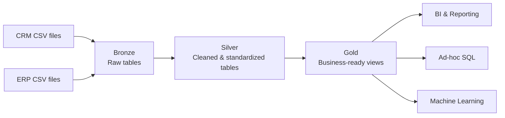

# SQL Data Engineering Portfolio

SQL Server data engineering portfolio covering data warehousing, exploratory data analysis, and advanced analytics.

## Project scope

This repository contains three connected SQL projects built as one end-to-end learning and portfolio track:

1. **SQL Data Warehouse** — ingest CRM and ERP CSV sources into a Bronze/Silver/Gold warehouse in SQL Server.
2. **Exploratory Data Analysis** — profile and understand the business-ready Gold layer.
3. **Advanced Data Analytics** — answer business questions with advanced SQL and reusable reporting views.

The implementation follows the project sequence from Data with Baraa while the repository structure, documentation, architecture evidence, reviews, and selected extensions are maintained as an independent portfolio implementation.

## Target architecture



Architecture source: [`01_data_warehouse/docs/data_architecture.drawio`](01_data_warehouse/docs/data_architecture.drawio)

## Repository structure

```text
sql-data-engineering-portfolio/
├── 01_data_warehouse/
│   ├── datasets/
│   │   ├── source_crm/
│   │   └── source_erp/
│   ├── docs/
│   │   ├── data_architecture.drawio
│   │   ├── project_requirements.md
│   │   ├── architecture_decisions.md
│   │   ├── naming_conventions.md
│   │   ├── data_flow/
│   │   └── data_model/
│   ├── scripts/
│   │   ├── bronze/
│   │   ├── silver/
│   │   └── gold/
│   └── tests/
│       ├── bronze/
│       ├── silver/
│       └── gold/
├── 02_exploratory_data_analysis/
│   ├── docs/
│   └── scripts/
├── 03_advanced_data_analytics/
│   ├── docs/
│   └── scripts/
├── .editorconfig
├── .gitignore
├── ACKNOWLEDGEMENTS.md
└── LICENSE
```

## Current status

**In progress.** The warehouse project is being implemented incrementally. Empty directories are intentionally retained with `.gitkeep` files until the corresponding project milestone is implemented.

## Engineering principles

- Separation of concerns across Bronze, Silver, and Gold.
- Preserve raw source data before transformation.
- Resolve data-quality issues before analytical consumption.
- Keep business logic and analytical modeling in the Gold layer.
- Validate each layer before downstream use.
- Document architecture, lineage, data model, and design decisions.
- Commit meaningful project milestones rather than uploading a finished tutorial clone.

## Technology

- Microsoft SQL Server
- T-SQL
- CSV source files
- Git / GitHub
- diagrams.net / Draw.io

## License

MIT License. See [`LICENSE`](LICENSE).
