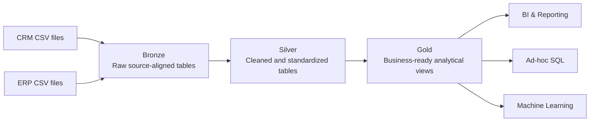

# SQL Data Engineering Portfolio

This repository contains a connected SQL Server portfolio track covering **data warehousing**, **exploratory data analysis**, and **advanced SQL analytics**.

The projects are based on the project sequence taught by **Data with Baraa**, but are implemented, documented, reviewed, and extended as an independent portfolio build. The objective is not to publish a tutorial clone, but to demonstrate a traceable engineering workflow from requirements and architecture through implementation, validation, documentation, and analytics.

## Portfolio Track

| Project | Focus | Status |
|---|---|---|
| [01 — SQL Data Warehouse](01_data_warehouse/) | Data Engineering: CRM + ERP ingestion, Bronze/Silver/Gold architecture, data quality, integration, dimensional modeling | **In progress — Bronze** |
| [02 — Exploratory Data Analysis](02_exploratory_data_analysis/) | Data profiling, dimensions, date ranges, measures, magnitude and ranking analysis | Planned |
| [03 — Advanced Data Analytics](03_advanced_data_analytics/) | Trends, cumulative analysis, performance analysis, segmentation, part-to-whole and reporting views | Planned |

## End-to-End Flow



The editable architecture source is maintained in [`01_data_warehouse/docs/data_architecture.drawio`](01_data_warehouse/docs/data_architecture.drawio).

## Current Milestone

The active project is **01 — SQL Data Warehouse**.

Completed so far:

- Requirements analyzed and documented.
- Medallion-style Bronze/Silver/Gold architecture selected.
- High-level architecture created in Draw.io.
- Detailed project plan and naming conventions defined.
- SQL Server `DataWarehouse` database and Bronze/Silver/Gold schemas created.
- Six source-aligned Bronze tables implemented.
- CRM and ERP CSV ingestion implemented with `bronze.load_bronze`.
- Bronze schema validation implemented.
- Bronze load/reconciliation validation implemented.
- Source-system inventory and CSV mapping documented.

**Next milestone:** document the detailed **Source → Bronze data flow** in Draw.io, then close the Bronze epic before starting Silver analysis.

## Bronze Engineering Pattern

```text
CRM / ERP CSV files
        ↓
Source-aligned Bronze DDL
        ↓
TRUNCATE TABLE + BULK INSERT
        ↓
Schema + load validation
        ↓
Data-flow documentation
```

The loader follows the Data with Baraa course baseline while adding explicit Git-versioned validation and clearer error propagation.

## Engineering Principles

- **Separation of concerns:** ingestion, cleansing, integration, modeling, and consumption have explicit responsibilities.
- **Raw preservation:** source data is preserved before transformation.
- **Data quality before analytics:** cleansing and validation occur before business consumption.
- **Consumer contract:** analytical consumers use the Gold layer rather than raw source tables.
- **Traceability:** requirements, source mappings, architecture decisions, tests, and implementation artifacts are version-controlled.
- **Incremental project history:** meaningful milestones are committed as the project is built.

## Repository Structure

```text
sql-data-engineering-portfolio/
├── 01_data_warehouse/
│   ├── datasets/
│   ├── docs/
│   ├── scripts/
│   │   ├── init_database.sql
│   │   ├── bronze/
│   │   ├── silver/
│   │   └── gold/
│   └── tests/
│       ├── bronze/
│       ├── silver/
│       └── gold/
├── 02_exploratory_data_analysis/
├── 03_advanced_data_analytics/
├── ACKNOWLEDGEMENTS.md
├── LICENSE
├── .editorconfig
└── .gitignore
```

## Technology

- Microsoft SQL Server
- T-SQL
- SQL Server Management Studio (SSMS)
- CSV source files
- Git / GitHub
- diagrams.net / Draw.io
- Notion for project planning

## Documentation

The active warehouse documentation is located in [`01_data_warehouse/docs/`](01_data_warehouse/docs/):

- [Project Requirements](01_data_warehouse/docs/project_requirements.md)
- [Project Plan](01_data_warehouse/docs/project_plan.md)
- [Architecture Decisions](01_data_warehouse/docs/architecture_decisions.md)
- [Naming Conventions](01_data_warehouse/docs/naming_conventions.md)
- [Source Systems](01_data_warehouse/docs/source_systems.md)
- [Draw.io Architecture](01_data_warehouse/docs/data_architecture.drawio)

## Attribution

The learning baseline, project scenario, and source datasets originate from **Data with Baraa's SQL course and project materials**. This repository documents my own implementation process, architecture reasoning, validation work, documentation, and later portfolio extensions. See [`ACKNOWLEDGEMENTS.md`](ACKNOWLEDGEMENTS.md).

## License

This repository is licensed under the [MIT License](LICENSE).
