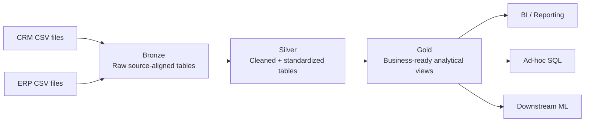

# SQL Data Engineering Portfolio

A connected SQL Server portfolio track covering **data warehousing**, **exploratory data analysis**, and **advanced SQL analytics**.

The projects follow the learning sequence taught by **Data with Baraa**, but this repository maintains an independent, version-controlled implementation with explicit requirements, architecture decisions, validation, documentation, engineering learnings, and clear scope boundaries.

> **10-second summary:** the completed first project turns six CRM/ERP CSV sources into a validated Bronze/Silver/Gold SQL Server warehouse with dimensional Gold views, Data Quality checks, lineage and a data catalog. The next two projects build EDA and advanced analytics on top of the same model.

## Portfolio Track

| Project | Focus | Status |
|---|---|---|
| [01 — SQL Data Warehouse](01_data_warehouse/) | CRM + ERP ingestion, Bronze/Silver/Gold architecture, Data Quality, integration, dimensional modeling and lineage | **Complete** |
| [02 — Exploratory Data Analysis](02_exploratory_data_analysis/) | Database exploration, dimensions, date ranges, measures, magnitude and ranking analysis | **In progress** |
| [03 — Advanced Data Analytics](03_advanced_data_analytics/) | Trends, cumulative analysis, performance analysis, segmentation, part-to-whole and reporting views | Planned |

## Completed Data Warehouse

### Architecture



### Dataset and validated scale

The accepted Gold snapshot contains:

| Gold object | Rows |
|---|---:|
| `gold.dim_customers` | **18,484** |
| `gold.dim_products` | **295 current products** |
| `gold.fact_sales` | **60,398 sales lines** |

These numbers describe the supplied learning dataset only. They are not presented as production-scale workload evidence.

### What is implemented

- six source-aligned Bronze tables and `bronze.load_bronze`
- six cleansed Silver tables and `silver.load_silver`
- Bronze, Silver and Gold validation scripts
- Gold analytical views `dim_customers`, `dim_products`, and `fact_sales`
- explicit grain and dimensional relationships
- source precedence and integration-key decisions
- source-to-Gold lineage and integration documentation
- star-schema documentation
- column-level Gold data catalog
- phase-based engineering learning journal

## Technical Stack by System Role

| System role | Implementation |
|---|---|
| **Connect / Ingestion** | CSV source files loaded into SQL Server Bronze |
| **Buffer / Raw preservation** | Bronze source-aligned tables preserve the landing boundary |
| **Processing** | T-SQL cleansing, standardization, integration and analytical shaping |
| **Storage** | Microsoft SQL Server |
| **Modeling / Serving** | Silver integration + Gold dimensional views |
| **Data Quality** | layer-specific validation scripts, key/cardinality and row-preservation checks |
| **Orchestration** | not implemented; loading is procedure-driven and manually executed |
| **Observability** | validation queries and runtime checks; no production monitoring stack is claimed |
| **Documentation** | requirements, ADR-style decisions, lineage, data model, data catalog and learning journal |

## Engineering Decisions and Constraints

This project intentionally keeps the learning scenario bounded.

- **Bronze preserves source fidelity.** Cleansing belongs downstream.
- **Silver standardizes before integration.** Technical validity alone is not enough; values must also be plausible and join-ready.
- **Gold exposes business objects with explicit grain.** A view that returns rows is not automatically a valid analytical model.
- **Data Quality precedes analytics.** Successful SQL execution is not treated as proof that data is correct.
- **Full refresh is accepted for this scope.** There is no claim of CDC, incremental orchestration, SCD infrastructure or production SLA handling.
- **Gold uses views.** The project does not pretend to implement a production semantic layer or serving platform.
- **Surrogate-key behavior is snapshot-scoped.** Stability across production reloads is not claimed.

## What I Learned Building It

The repository includes a dedicated [engineering learning journal](01_data_warehouse/learnings/README.md) rather than treating course completion as the evidence.

The recurring lessons are:

- requirements and architecture choices need to be explicit before writing transformation SQL;
- ingestion must be reconciled rather than assumed complete;
- cleansing must preserve traceability back to source facts;
- joins must be checked for cardinality and row multiplication;
- dimensions and facts require explicit grain and key semantics;
- source precedence is a business decision, not merely a SQL operation;
- a working query is insufficient if another engineer cannot understand, test or reproduce the result.

The individual phase notes document what can go wrong even when SQL itself executes successfully.

## Repository Structure

```text
sql-data-engineering-portfolio/
├── 01_data_warehouse/
│   ├── datasets/
│   ├── docs/
│   ├── learnings/
│   ├── scripts/
│   └── tests/
├── 02_exploratory_data_analysis/
├── 03_advanced_data_analytics/
├── ACKNOWLEDGEMENTS.md
├── LICENSE
├── .editorconfig
└── .gitignore
```

## Suggested Review Path

For a fast technical review:

1. [Data Warehouse README](01_data_warehouse/README.md) — complete project scope and execution path
2. [Gold star schema](01_data_warehouse/docs/data_model/gold_star_schema.drawio) — analytical model
3. [End-to-end lineage](01_data_warehouse/docs/data_flow/bronze_silver_gold_data_flow.drawio) — source-to-Gold flow
4. [Gold data catalog](01_data_warehouse/docs/data_catalog/gold_data_catalog.md) — consumer-facing schema semantics
5. [Engineering learning journal](01_data_warehouse/learnings/README.md) — decisions, failure modes and lessons
6. [Validation scripts](01_data_warehouse/tests/) — evidence that correctness is checked explicitly

## Technology

- Microsoft SQL Server
- T-SQL
- SQL Server Management Studio (SSMS)
- CSV source files
- Git / GitHub
- diagrams.net / Draw.io

## Attribution

The learning baseline, project scenario, and source datasets originate from **Data with Baraa's SQL course and project materials**. This repository documents my implementation process, validation, documentation and targeted refinements. See [`ACKNOWLEDGEMENTS.md`](ACKNOWLEDGEMENTS.md).

## TL;DR

This repository is not presented as production Data Engineering experience. It is evidence that I can move beyond individual SQL queries and reason about a warehouse as a system: **source boundaries → ingestion → cleansing → integration → dimensional modeling → Data Quality → lineage → analytical use**.

## License

This repository is licensed under the [MIT License](LICENSE).
