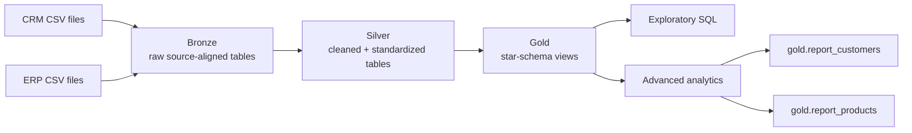

# SQL Data Engineering Portfolio

A connected SQL Server portfolio that moves one supplied CRM/ERP sales dataset through **data warehousing, exploratory analysis, and advanced analytical reporting**.

> **10-second summary:** six CRM/ERP source files are modeled through Bronze/Silver/Gold into a validated star schema, explored with six EDA scripts, then analyzed with window functions, CTEs, segmentation and two reusable Gold reporting views. All three project phases are complete.

## Portfolio Track

| Project | Focus | Status |
|---|---|---|
| [01 - SQL Data Warehouse](01_data_warehouse/) | ingestion, Bronze/Silver/Gold architecture, Data Quality, integration, dimensional modeling, lineage | **Complete** |
| [02 - Exploratory Data Analysis](02_exploratory_data_analysis/) | metadata, dimensions, date ranges, measures, magnitude, ranking | **Complete** |
| [03 - Advanced Data Analytics](03_advanced_data_analytics/) | time analysis, cumulative metrics, performance benchmarking, part-to-whole, segmentation, reusable reports | **Complete** |

## End-to-End Architecture



The portfolio intentionally keeps the technology surface small: **SQL Server + T-SQL + Git/GitHub**. The engineering evidence is in the data model, SQL, validation, lineage, documentation and reasoning rather than in unrelated tooling.

## Evidence at a Glance

### 1. Data Warehouse

The completed warehouse integrates CRM and ERP into three business-facing Gold views:

| Gold object | Validated grain | Rows |
|---|---|---:|
| `gold.dim_customers` | one row per CRM customer | **18,484** |
| `gold.dim_products` | one row per current product | **295** |
| `gold.fact_sales` | one row per source order/product sales line | **60,398** |

Implemented evidence includes:

- six source-aligned Bronze tables and `bronze.load_bronze`;
- six cleaned Silver tables and `silver.load_silver`;
- Gold dimensional views with explicit grain and source precedence;
- Bronze/Silver/Gold validation queries;
- architecture, lineage, integration models and a Gold data catalog;
- a phase-based engineering learning journal.

Start with the [Data Warehouse README](01_data_warehouse/README.md).

### 2. Exploratory Data Analysis

Six focused SQL scripts profile the Gold model before more complex analysis:

```text
Database -> Dimensions -> Dates -> Measures -> Magnitude -> Ranking
```

Selected reproducible snapshot findings:

| Metric | Value |
|---|---:|
| Total sales | **29,356,250** |
| Distinct orders | **27,659** |
| Total quantity | **60,423** |
| Order-date range | **2010-12-29 -> 2014-01-28** |
| Largest named customer market | **United States - 7,482 customers** |
| Highest-revenue product | **Mountain-200 Black- 46 - 1,373,454** |

Start with the [EDA README](02_exploratory_data_analysis/README.md) or [EDA findings](02_exploratory_data_analysis/docs/findings.md).

### 3. Advanced Data Analytics

The final phase builds higher-level analytical patterns on the same Gold facts and dimensions:

- change-over-time analysis;
- cumulative running metrics;
- product performance vs. historical average and prior year;
- category contribution to total sales;
- product and customer segmentation;
- reusable `gold.report_customers` and `gold.report_products` views.

Selected snapshot results:

| Result | Value |
|---|---:|
| Customer report rows | **18,484** |
| Sold-product report rows | **130** |
| VIP / Regular / New customers | **1,655 / 2,198 / 14,631** |
| High / Mid / Low product performers | **66 / 58 / 6** |
| Bikes share of sales | **96.46%** |

`gold.report_products` is intentionally fact-anchored and therefore contains **products with sales**, not all 295 current products in `gold.dim_products`.

Start with the [Advanced Analytics README](03_advanced_data_analytics/README.md).

## Skills Demonstrated

| Area | Repository evidence |
|---|---|
| **SQL / T-SQL** | joins, CTEs, subqueries, aggregates, window functions, `LAG`, `ROW_NUMBER`, views, stored procedures |
| **Data Engineering** | source ingestion, layered architecture, cleansing, integration, dimensional modeling, explicit grain |
| **Data Quality** | row reconciliation, key/cardinality checks, referential checks, measure preservation, report validation |
| **Analytics** | EDA, time-series aggregation, running totals, benchmarking, part-to-whole, segmentation, KPI reports |
| **Documentation** | requirements, architecture decisions, lineage, data catalog, query catalogs, report contracts, learning journals |
| **Engineering judgment** | scope boundaries, source precedence, failure modes, limitations and evidence-backed claims |

## Technical Review Path

For a fast recruiter or technical review:

1. [This README](README.md) - portfolio scope and evidence boundaries
2. [Data Warehouse README](01_data_warehouse/README.md) - architecture and implementation
3. [Gold star schema](01_data_warehouse/docs/data_model/gold_star_schema.webp) - final analytical model
4. [Gold data catalog](01_data_warehouse/docs/data_catalog/gold_data_catalog.md) - base-view semantics
5. [EDA query catalog](02_exploratory_data_analysis/docs/query_catalog.md) - questions mapped to SQL
6. [Advanced Analytics README](03_advanced_data_analytics/README.md) - final analytical layer
7. [Advanced report catalog](03_advanced_data_analytics/docs/report_catalog.md) - reusable report-view contract
8. [Advanced validation](03_advanced_data_analytics/tests/01_validate_advanced_analytics.sql) - report grain and reconciliation checks

## Repository Structure

```text
sql-data-engineering-portfolio/
├── 01_data_warehouse/
│   ├── datasets/
│   ├── docs/
│   ├── learnings/
│   ├── scripts/
│   └── tests/
├── 02_exploratory_data_analysis/
│   ├── docs/
│   ├── learnings/
│   └── scripts/
├── 03_advanced_data_analytics/
│   ├── docs/
│   ├── learnings/
│   ├── scripts/
│   └── tests/
├── ACKNOWLEDGEMENTS.md
├── LICENSE
├── .editorconfig
└── .gitignore
```

## Technology and Runtime

- Microsoft SQL Server
- T-SQL
- SQL Server Management Studio (SSMS)
- Git / GitHub
- diagrams.net / Draw.io

The analytics scripts use `DATETRUNC`, so **SQL Server 2022+** is the practical runtime baseline for the complete portfolio without query rewrites.

## Evidence Boundaries

This repository is a **learning and portfolio implementation**, not a claim of production Data Engineering employment experience.

Deliberate scope limits include:

- local full-refresh loading rather than CDC/incremental orchestration;
- no production scheduler, SLA or monitoring stack;
- view-based Gold serving rather than a materialized semantic platform;
- snapshot-scoped `ROW_NUMBER()` surrogate keys;
- supplied course data rather than proprietary production data;
- analytical report `age` and `recency` use `GETDATE()` and are therefore time-dependent;
- report lifespan uses SQL Server `DATEDIFF(MONTH, ...)` boundary semantics.

These limits are documented so the repository shows what was actually built without overstating the evidence.

## Attribution

The learning scenario, project sequence, reference implementation and source datasets originate from **Data with Baraa's SQL course and project materials**. This repository contains an independent implementation, validation work, documentation and targeted correctness/maintainability refinements. See [`ACKNOWLEDGEMENTS.md`](ACKNOWLEDGEMENTS.md).

## License

MIT License - see [`LICENSE`](LICENSE).
