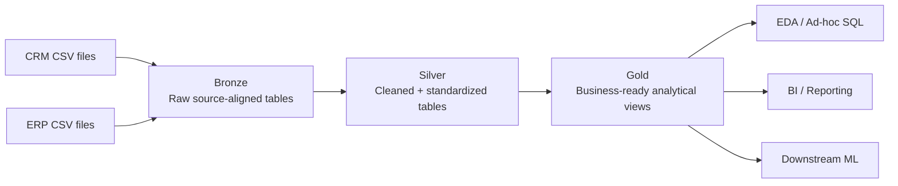

# SQL Data Engineering Portfolio

A connected SQL Server portfolio track covering **data warehousing**, **exploratory data analysis**, and **advanced SQL analytics**.

The projects follow the learning sequence taught by **Data with Baraa**, but this repository maintains an independent, version-controlled implementation with explicit requirements, architecture decisions, validation, documentation, engineering learnings, and clear scope boundaries.

> **10-second summary:** Project 01 turns six CRM/ERP CSV sources into a validated Bronze/Silver/Gold SQL Server warehouse. Project 02 consumes the Gold star schema through six EDA stages: metadata, dimensions, dates, measures, magnitude and ranking. Project 03 will extend the same model with advanced SQL analytics.

## Portfolio Track

| Project | Focus | Status |
|---|---|---|
| [01 - SQL Data Warehouse](01_data_warehouse/) | CRM + ERP ingestion, Bronze/Silver/Gold architecture, Data Quality, integration, dimensional modeling and lineage | **Complete** |
| [02 - Exploratory Data Analysis](02_exploratory_data_analysis/) | Database exploration, dimensions, date ranges, measures, magnitude and ranking analysis | **Complete** |
| [03 - Advanced Data Analytics](03_advanced_data_analytics/) | Trends, cumulative analysis, performance analysis, segmentation, part-to-whole and reporting views | Planned |

## Completed Data Warehouse

### Architecture



### Dataset and validated scale

The accepted Gold snapshot contains:

| Gold object | Rows |
|---|---:|
| `gold.dim_customers` | **18,484** |
| `gold.dim_products` | **295 current products** |
| `gold.fact_sales` | **60,398 sales lines** |

These numbers describe the supplied learning dataset only. They are not presented as production-scale workload evidence.

### What is implemented

- six source-aligned Bronze tables and `bronze.load_bronze`
- six cleansed Silver tables and `silver.load_silver`
- Bronze, Silver and Gold validation scripts
- Gold analytical views `dim_customers`, `dim_products`, and `fact_sales`
- explicit grain and dimensional relationships
- source precedence and integration-key decisions
- source-to-Gold lineage and integration documentation
- star-schema documentation
- column-level Gold data catalog
- phase-based engineering learning journal

## Completed Exploratory Data Analysis

The second project uses the Gold layer as a read-only analytical interface rather than rebuilding the data.

Implemented EDA sequence:

```text
Database metadata
      -> dimensions
      -> date boundaries
      -> key measures
      -> magnitude analysis
      -> ranking analysis
```

Repository evidence includes:

- six executable T-SQL analysis scripts;
- a query catalog mapping questions to SQL;
- documented dataset findings and interpretation caveats;
- a six-part learning journal covering grain, dimensions/measures, `COUNT DISTINCT`, joins, grouping and ranking semantics.

Selected reproducible snapshot metrics:

| Metric | Value |
|---|---:|
| Total sales | **29,356,250** |
| Distinct orders | **27,659** |
| Total quantity | **60,423** |
| Customers | **18,484** |
| Current products | **295** |
| Order-date range | **2010-12-29 -> 2014-01-28** |

Start with the [EDA project README](02_exploratory_data_analysis/README.md) or [EDA findings](02_exploratory_data_analysis/docs/findings.md).

## Technical Stack by System Role

| System role | Implementation |
|---|---|
| **Connect / Ingestion** | CSV source files loaded into SQL Server Bronze |
| **Buffer / Raw preservation** | Bronze source-aligned tables preserve the landing boundary |
| **Processing** | T-SQL cleansing, standardization, integration and analytical shaping |
| **Storage** | Microsoft SQL Server |
| **Modeling / Serving** | Silver integration + Gold dimensional views |
| **Data Quality** | layer-specific validation scripts, key/cardinality and row-preservation checks |
| **Analytics** | T-SQL EDA over Gold: metadata, dimensions, dates, measures, grouping and ranking |
| **Orchestration** | not implemented; loading is procedure-driven and manually executed |
| **Observability** | validation queries and runtime checks; no production monitoring stack is claimed |
| **Documentation** | requirements, ADR-style decisions, lineage, data model, data catalog, EDA findings and learning journals |

## Engineering Decisions and Constraints

This project intentionally keeps the learning scenario bounded.

- **Bronze preserves source fidelity.** Cleansing belongs downstream.
- **Silver standardizes before integration.** Technical validity alone is not enough; values must also be plausible and join-ready.
- **Gold exposes business objects with explicit grain.** A view that returns rows is not automatically a valid analytical model.
- **Data Quality precedes analytics.** Successful SQL execution is not treated as proof that data is correct.
- **EDA consumes Gold rather than source tables.** Analytical users should not have to reconstruct CRM/ERP integration logic.
- **Fact grain controls metric definitions.** `COUNT(order_number)` and `COUNT(DISTINCT order_number)` intentionally answer different questions.
- **Full refresh is accepted for this scope.** There is no claim of CDC, incremental orchestration, SCD infrastructure or production SLA handling.
- **Gold uses views.** The project does not pretend to implement a production semantic layer or serving platform.
- **Surrogate-key behavior is snapshot-scoped.** Stability across production reloads is not claimed.

## What I Learned Building It

The repository uses project-specific learning journals rather than treating course completion as the evidence.

Data Warehouse lessons include:

- requirements and architecture choices need to be explicit before transformation SQL;
- ingestion must be reconciled rather than assumed complete;
- joins must be checked for cardinality and row multiplication;
- dimensions and facts require explicit grain and key semantics.

EDA adds:

- explore schema metadata before business values;
- distinguish dimensions and measures by analytical role, not only data type;
- validate fact grain before counting orders or other entities;
- interpret `DATEDIFF` and dynamic date calculations precisely;
- treat `NULL` groups and join population deliberately;
- choose ranking functions based on tie semantics.

## Repository Structure

```text
sql-data-engineering-portfolio/
├── 01_data_warehouse/
│   ├── datasets/
│   ├── docs/
│   ├── learnings/
│   ├── scripts/
│   └── tests/
├── 02_exploratory_data_analysis/
│   ├── docs/
│   ├── learnings/
│   └── scripts/
├── 03_advanced_data_analytics/
├── ACKNOWLEDGEMENTS.md
├── LICENSE
├── .editorconfig
└── .gitignore
```

## Suggested Review Path

For a fast recruiter/technical review:

1. [Repository overview](README.md) - portfolio scope and evidence boundaries
2. [EDA README](02_exploratory_data_analysis/README.md) - completed analytical workflow and selected findings
3. [EDA query catalog](02_exploratory_data_analysis/docs/query_catalog.md) - business questions mapped to executable SQL
4. [EDA learning journal](02_exploratory_data_analysis/learnings/README.md) - grain, aggregation, join and ranking reasoning
5. [Data Warehouse README](01_data_warehouse/README.md) - upstream warehouse architecture and execution path
6. [Gold star schema](01_data_warehouse/docs/data_model/gold_star_schema.drawio) - analytical model
7. [Gold data catalog](01_data_warehouse/docs/data_catalog/gold_data_catalog.md) - consumer-facing schema semantics
8. [Validation scripts](01_data_warehouse/tests/) - explicit Data Quality evidence

## Technology

- Microsoft SQL Server
- T-SQL
- SQL Server Management Studio (SSMS)
- CSV source files
- Git / GitHub
- diagrams.net / Draw.io

## Attribution

The learning baseline, project scenario, and source datasets originate from **Data with Baraa's SQL course and project materials**. This repository documents my implementation process, validation, documentation and targeted refinements. See [`ACKNOWLEDGEMENTS.md`](ACKNOWLEDGEMENTS.md).

## TL;DR

This repository is not presented as production Data Engineering experience. It is evidence that I can reason across a connected SQL workflow:

**source boundaries -> ingestion -> cleansing -> integration -> dimensional modeling -> Data Quality -> exploratory analytics -> advanced analytics**

The first two projects are implemented; advanced analytics is the next scoped phase.

## License

This repository is licensed under the [MIT License](LICENSE).
